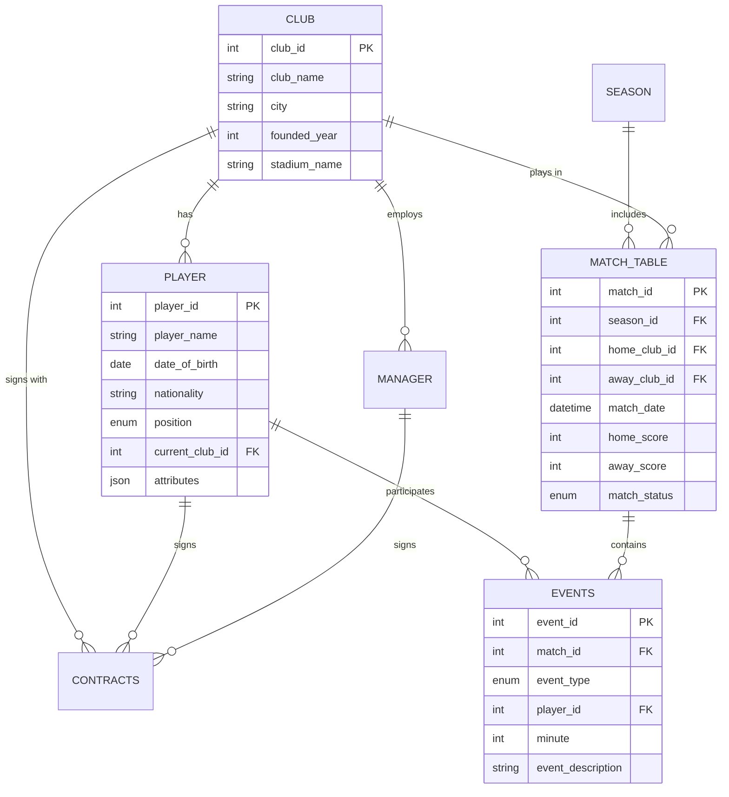

# CLUBSYNC - Football Data Management System

**A centralized RDBMS platform for managing football data in Bangladesh**


## 📋 Overview

CLUBSYNC is a comprehensive football data management system designed for Bangladesh's local tournaments. It provides a robust platform to manage players, clubs, managers, matches, and events while offering powerful analytics and real-time statistics.

### Key Features

- **Player Management**: Detailed player profiles with JSON-based attributes
- **Match Operations**: Real-time match tracking with auto-generated event descriptions
- **Analytics Engine**: Live league tables, top scorer lists, and season summaries
- **Security & Auditing**: JWT authentication, role-based access control, and comprehensive audit logging
- **Modern UI**: Dark mode design with glassmorphism effects and smooth animations

## 🏗️ Technology Stack

### Backend
- **Database**: MySQL 8.0+
- **Runtime**: Node.js
- **Framework**: Express.js
- **Authentication**: JWT (JSON Web Tokens)
- **Security**: bcryptjs for password hashing

### Frontend
- **Framework**: React 18
- **Build Tool**: Vite
- **Routing**: React Router DOM
- **HTTP Client**: Axios
- **Charts**: Chart.js with react-chartjs-2

## 📊 Database Schema



## 🚀 Getting Started

### Prerequisites

- **MySQL** 8.0 or higher
- **Node.js** 16.x or higher
- **npm** or **yarn**

### Installation

#### 1. Clone the Repository

```bash
cd "C:\Users\hp\Desktop\RDBMS PROJECT"
```

#### 2. Database Setup

```bash
# Login to MySQL
mysql -u root -p

# Create database and import schema
CREATE DATABASE clubsync;
USE clubsync;
source database/schema.sql;

# Create a test admin user (password: admin123)
# Note: Use a proper password hash in production
```

#### 3. Backend Setup

```bash
cd backend

# Install dependencies
npm install

# Create environment file
copy .env.example .env

# Edit .env file with your MySQL credentials
# DB_PASSWORD=your_mysql_password
# JWT_SECRET=your_secret_key

# Start the server
npm run dev
```

The backend server will run on `http://localhost:5000`

#### 4. Frontend Setup

```bash
cd ../frontend

# Install dependencies
npm install

# Start development server
npm run dev
```

The frontend will run on `http://localhost:5173`

### Default Login

After setting up the database, create an admin user or use the demo credentials:

```sql
INSERT INTO APP_USER (username, email, password_hash, full_name, role)
VALUES ('admin', 'admin@clubsync.bd', '$2a$10$YourBcryptHashHere', 'System Administrator', 'ADMIN');
```

## 📁 Project Structure

```
RDBMS PROJECT/
├── database/
│   └── schema.sql              # MySQL database schema
├── backend/
│   ├── config/
│   │   └── database.js         # Database connection
│   ├── middleware/
│   │   └── auth.js             # Authentication middleware
│   ├── routes/
│   │   ├── players.js          # Player management
│   │   ├── clubs.js            # Club management
│   │   ├── matches.js          # Match operations
│   │   ├── events.js           # Match events
│   │   ├── analytics.js        # Statistics & analytics
│   │   ├── auth.js             # Authentication
│   │   └── admin.js            # Admin panel
│   ├── package.json
│   └── server.js               # Express server
└── frontend/
    ├── public/
    ├── src/
    │   ├── components/
    │   │   └── Navbar.jsx      # Navigation bar
    │   ├── pages/
    │   │   ├── Home.jsx        # Dashboard
    │   │   ├── Players.jsx     # Player management
    │   │   ├── Matches.jsx     # Match management
    │   │   ├── StatsCenter.jsx # Statistics
    │   │   ├── AdminPanel.jsx  # Admin panel
    │   │   └── Login.jsx       # Authentication
    │   ├── api.js              # Axios configuration
    │   ├── App.jsx             # Main app component
    │   └── index.css           # Global styles
    ├── package.json
    └── vite.config.js
```

## 🎯 Sprint-Based Development

### Sprint 1: The Foundation ✅
- [x] MySQL database schema
- [x] Player management API
- [x] Frontend player management UI

### Sprint 2: Matchday Operations ✅
- [x] Match management API
- [x] Match event logger with auto-description
- [x] Match dashboard UI

### Sprint 3: Analytics Engine ✅
- [x] League table generation
- [x] Top scorers list
- [x] Stats Center with visualizations

### Sprint 4: Security & Administration ✅
- [x] JWT authentication
- [x] Role-based access control
- [x] Audit logging
- [x] Admin panel

## 🔌 API Endpoints

### Authentication
- `POST /api/auth/register` - Register new user
- `POST /api/auth/login` - User login
- `GET /api/auth/me` - Get current user

### Players
- `GET /api/players` - List all players
- `GET /api/players/:id` - Get player details
- `POST /api/players` - Add new player
- `PUT /api/players/:id` - Update player
- `DELETE /api/players/:id` - Delete player

### Matches
- `GET /api/matches` - List matches
- `POST /api/matches` - Create match
- `GET /api/matches/:id` - Get match details
- `POST /api/events` - Log match event

### Analytics
- `GET /api/analytics/league-table/:seasonId` - Get standings
- `GET /api/analytics/top-scorers/:seasonId` - Get top scorers
- `GET /api/analytics/season-summary/:seasonId` - Get season stats

### Admin
- `GET /api/admin/users` - List users (Admin only)
- `GET /api/admin/audit-logs` - View audit logs (Admin only)
- `GET /api/admin/stats` - System statistics (Admin only)

## 🎨 Design Features

- **Dark Mode**: Modern dark theme optimized for readability
- **Glassmorphism**: Frosted glass effect on cards and modals  
- **Smooth Animations**: Micro-interactions for better UX
- **Responsive Design**: Mobile-friendly layout
- **Color-Coded Positions**: Visual differentiation for player positions
- **Real-time Updates**: Live match scores and statistics

## 🔒 Security Features

- **Password Hashing**: bcrypt for secure password storage
- **JWT Authentication**: Stateless authentication
- **Role-Based Access**: ADMIN, EDITOR, and VIEWER roles
- **Audit Logging**: Track all data modifications
- **Input Validation**: Express-validator for API security

## 📈 Future Enhancements

- Player transfer management
- Advanced analytics (xG, heat maps)
- Mobile application
- Multi-language support
- PDF report generation
- Email notifications
- Real-time websocket updates

## 🤝 Contributing

This is an academic project for Bangladesh Premier League data management. For modifications or suggestions, please contact the development team.

## 📝 License

MIT License - See LICENSE file for details

## 👏 Acknowledgments

- Designed for Bangladesh Football Data Management
- Built with modern web technologies
- Inspired by international football management systems

---

**Made with ⚽ for Bangladesh Football**
